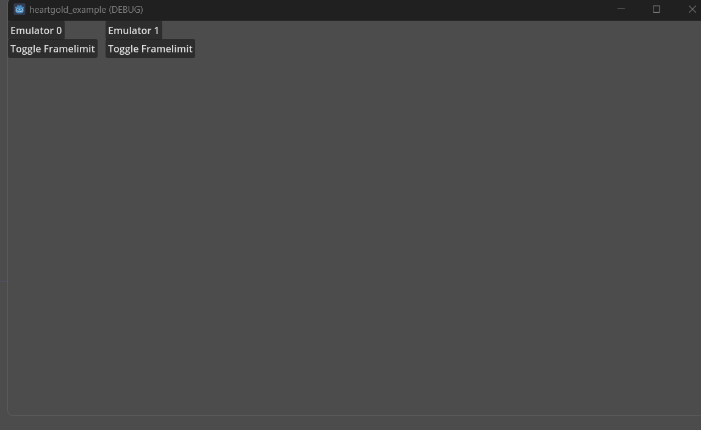

# GD-NDS-Bridge

This is a fork of NDS Ironmon Tracker for very specific usage, please see the [original project](https://github.com/Brian0255/NDS-Ironmon-Tracker) for more information.

*This is still Work in progress*

- Folder specifically for this project:

- ironmon_tracker/godot/GodotMain as an override for the original NDS Ironmon Tracker MainLoop.
- IronMon-Godot.lua for the entry point.

For testing the example:

Clone the repository and copy a Bizhawk folder to a dir called `Bizhawk` in the root of the repository.
Use VSCode and Godot Tools to open the git repo project as a workspace for debugging.

Check so all paths in the example matches.
- The root of the repository
- You need to have a matching rom path, 
- a folder in the Bizhawk folder called `GodotData`

The godot example will refer to this path for the ironmon script, so its easier to test, but it can be any location.

